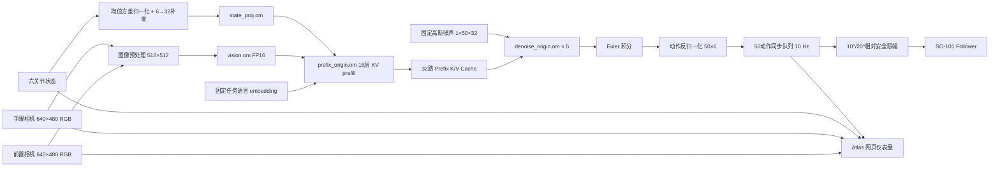

# Atlas 200I DK A2 SmolVLA NPU 部署与实机推理技术开发文档

> 日期：2026-08-14  
> 项目目录：`F:\robot_arm_atlas`  
> 板端目录：`/root/lerobot_project`  
> 文档状态：开发、部署、数值验证、实机闭环和完整任务均已完成

## 1. 项目目标与最终结论

本次开发的目标是将已经训练完成的 SmolVLA 策略部署到 Atlas 200I DK A2 开发板，使开发板不依赖 PC 完成以下闭环：

```text
双相机采集
→ 六关节状态读取
→ SmolVLA 视觉/语言/状态融合
→ 动作专家流匹配推理
→ 生成 50×6 动作块
→ SO-101 从臂执行
→ 网页仪表盘监控
```

最终结果：

- SmolVLA 神经网络推理全部运行在 Atlas 的 Ascend 310B1 NPU 上；
- PC 只用于 SSH、传输文件和打开网页仪表盘，不参与推理；
- 双相机、Follower 六个舵机、NPU 模型和动作下发已经形成完整闭环；
- 固定金样的完整 NPU 动作块与 CPU 参考结果对齐；
- 实机已完成单步、连续动作、自动回位和完整黄块任务；
- 最终控制逻辑已经与 PC 端 `inference_with_live_monitor.py` 的 LeRobot 同步 rollout 语义对齐；
- 当前版本已具备真实任务运行能力，不再是仅完成模型加载或子图测试的实验版本。

## 2. 系统组成

### 2.1 硬件

| 设备 | 配置/标识 |
|---|---|
| 开发板 | Atlas 200I DK A2 |
| NPU | Ascend 310B1 |
| Follower | SO-ARM101 / SO101 Follower |
| Follower USB 序列号 | `5C82108953` |
| Leader USB 序列号 | `5C4C123788`，自主推理不使用 |
| 前置相机 | USB PID `9221`，当前映射 `/dev/video0` |
| 手眼相机 | USB PID `9005`，当前映射 `/dev/video2` |
| 板端地址 | `192.168.0.2` |
| 板端主机名 | `davinci-mini` |
| 架构 | `aarch64` |

### 2.2 软件环境

| 项目 | 版本/路径 |
|---|---|
| LeRobot | `0.6.1` |
| PyTorch | `2.7.1+cpu` |
| LeRobot Python | `/opt/lerobot061/bin/python` |
| NPU 部署 Python | `/opt/smolvla_npu_test/bin/python` |
| CANN | `7.0.RC1` |
| NPU 运行接口 | pyACL + AclLite |
| ATC 目标 SoC | `Ascend310B1` |

`/opt/smolvla_npu_test` 是独立的 NPU 转换和运行实验环境，通过 `lerobot061.pth` 引用原有 `/opt/lerobot061` 包。这样没有覆盖或破坏已经能正常采集、遥操作和清洗数据的 LeRobot 环境。

### 2.3 数据集与模型

```text
数据集：/root/lerobot_project/datasets/admin/smolvla_yellow_block_atlas_v2_clean
数据集频率：20 Hz
Episode 数：50
总帧数：8453

模型根目录：
/root/lerobot_project/models/smolvla_yellow_block_atlas_v2_clean_a100

部署检查点：
/root/lerobot_project/models/smolvla_yellow_block_atlas_v2_clean_a100/020000/pretrained_model

latest 软链接：
/root/lerobot_project/models/smolvla_yellow_block_atlas_v2_clean_a100/latest
```

固定任务指令：

```text
Pick up the yellow block, place it inside the black box, release it,
then return the arm to its starting position.
```

当前 Atlas 版本使用预计算的 48-token 语言 embedding，因此修改运行器中的显示字符串不会自动改变策略指令。如需支持任意自然语言任务，需要把 tokenizer 和语言 embedding 动态路径加入板端运行器，或为不同任务生成独立语言前缀模板。

## 3. 总体架构



## 4. 为什么没有直接在板端运行完整 PyTorch SmolVLA

Atlas 当前环境没有可直接使用的 `torch_npu` SmolVLA 执行路径。完整 PyTorch CPU 推理虽然能够运行，但速度不适合真实控制。

板端 CPU 基线测试结果：

| 指标 | 结果 |
|---|---:|
| 模型加载 | 45.88 s |
| 首次推理 | 73.91 s |
| 稳态推理平均 | 73.68 s |
| 峰值 RSS | 2563.25 MiB |
| 输出 | `50×6` |
| NaN/Inf | 无 |
| 重复推理确定性 | 10 次完全一致 |

因此选择了“拆分 ONNX → ATC 编译 OM → pyACL 串联”的路线，而没有升级或覆盖现有 PyTorch 环境。

## 5. 开发与部署过程

### 5.1 板端依赖准备

在 `/opt/lerobot061` 补充了 SmolVLA CPU 加载所需依赖，包括：

```text
transformers 5.5.4
accelerate 1.14
tokenizers
num2words
```

单独建立：

```text
/opt/smolvla_npu_test
```

该环境安装 ONNX 导出依赖：

```text
onnx 1.17
protobuf 5.29.5
ml_dtypes
```

ATC 使用系统 Python 3.10，其依赖放在：

```text
/opt/cann_py310_deps
```

包含 NumPy 1.21.6、SciPy 1.7.3、protobuf 3.20.3、SymPy、Pulp、Synr 等 CANN 7.0.RC1 所需包。

ATC 标准环境：

```bash
. /usr/local/Ascend/ascend-toolkit/set_env.sh
export PYTHONPATH=/opt/cann_py310_deps:/usr/local/Ascend/ascend-toolkit/latest/python/site-packages:/usr/local/Ascend/ascend-toolkit/latest/opp/built-in/op_impl/ai_core/tbe
```

### 5.2 MatMul 冒烟测试

首先建立最小 ONNX MatMul/Add 模型，验证以下链路：

```text
PyTorch/NumPy参考
→ ONNX
→ ATC
→ OM
→ pyACL
```

100 次运行通过，平均约 `0.210 ms`，最大误差约 `7.81e-4`。该步骤证明 ATC 和 pyACL 基础环境可用，随后才开始转换真实 SmolVLA 子图。

### 5.3 State Projection

SmolVLA 原始关节状态为 6 维，模型内部要求补零到 32 维：

```text
1×6 → 归一化 → 1×32 → state_proj.om → 1×960
```

结果：

| 指标 | 数值 |
|---|---:|
| OM 大小 | 94,242 bytes |
| 最大绝对误差 | `3.3921e-4` |
| 平均绝对误差 | `7.9121e-5` |
| 平均延迟 | `0.218 ms` |
| 100 次测试 | PASS |

真实运行器初版曾直接把 `1×6` 输入交给该 OM，ACL 根据模型输入大小拒绝执行。补齐 `6→32` 后真实观察推理通过。

### 5.4 Vision Encoder 与 Connector

视觉子图包括：

```text
SigLIP patch embedding
→ position embedding
→ vision encoder
→ post layer norm
→ modality connector
```

固定输入和输出：

```text
输入：1×3×512×512
输出：1×64×960
```

Transformers 原始动态 attention mask 不能稳定导出 ONNX，因此部署包装器采用：

- 固定 512×512 输入；
- 16×16 patch；
- 固定 position id `0..1023`；
- eager attention；
- 不创建动态 padding mask。

最终选用 `vision.om`：

| 指标 | 前置相机 | 手眼相机 |
|---|---:|---:|
| OM 大小 | 202,680,054 bytes | 共用同一个 OM |
| 平均延迟 | 184.65 ms | 184.69 ms |
| 最大绝对误差 | 0.1688 | 0.1796 |
| 平均绝对误差 | 0.01165 | 0.01317 |

说明：最初为视觉子图设置了 `max_abs_error <= 0.15` 的保守阈值，因此孤立视觉报告显示 FAIL。该结果没有被直接忽略，而是继续通过 Prefix、Denoise、完整动作块及实机任务评估其真实影响。最终动作平均误差和实机任务均通过，因此选用速度更快的 FP16 Vision。

`vision_origin.om` 使用 `must_keep_origin_dtype`，但误差和延迟反而明显变差，未用于最终部署。

### 5.5 Prefix KV Prefill

Prefix 输入由以下部分组成：

```text
前置视觉 token：64
手眼视觉 token：64
语言 token：48
状态 token：1
总长度：177
hidden size：960
```

Prefix 模型执行 16 层文本 Transformer，输出每层 K/V，共 32 个张量。

默认 `force_fp16` 和混合精度版本会在深层产生累计误差，因此最终使用：

```bash
--precision_mode=must_keep_origin_dtype
--op_select_implmode=high_precision
```

最终结果：

| 指标 | 结果 |
|---|---:|
| 文件 | `prefix_origin.om` |
| 大小 | 594,250,867 bytes |
| 输入 | `1×177×960` |
| 输出 | 32 路 K/V |
| 最大绝对误差 | `2.5749e-5` |
| 平均误差 | `5.8215e-7` |
| 平均延迟 | `173.77 ms` |
| 状态 | PASS |

### 5.6 Action Expert 单步去噪

去噪子图包含：

- action input projection；
- timestep sinusoidal embedding；
- time MLP；
- 16 层 action expert；
- Prefix K/V 的 self/cross attention；
- RMSNorm；
- action output projection。

固定输入/输出：

```text
x_t：1×50×32
timestep：1
Prefix K/V：32路
velocity：1×50×32
```

导出包装器与 LeRobot 原生 `denoise_step` 先进行 CPU 等价性证明：

```text
max_abs_error = 2.38418579e-6
```

随后转换 `denoise_origin.om`：

| 指标 | 结果 |
|---|---:|
| 大小 | 401,253,660 bytes |
| 最大绝对误差 | `4.0531e-6` |
| 平均绝对误差 | `3.8624e-7` |
| 单步平均延迟 | `56.95 ms` |
| 状态 | PASS |

### 5.7 完整 NPU 动作流水线

固定金样首先以 10 步 Euler 积分验证完整流水线：

| 指标 | 结果 |
|---|---:|
| 输出维度 | `50×6` |
| 有限值 | 是 |
| NPU vs 相同 Prefix CPU 最大误差 | `1.9073e-6` |
| NPU vs 相同 Prefix CPU 平均误差 | `1.5654e-7` |
| NPU vs 原始 CPU 策略最大归一化误差 | `0.02819` |
| NPU vs 原始 CPU 策略平均归一化误差 | `0.001904` |
| 反归一化后的平均动作误差 | 约 `0.043°` |
| 10 步完整延迟 | `1364.65 ms` |
| 状态 | PASS |

实机最终采用与 PC 监控脚本相同的 5 步去噪，完整 NPU 推理实测约 `918 ms`。

## 6. 精度策略与模型轻量化现状

最终精度组合：

```text
Vision：FP16 OM
State Projection：默认高性能 OM
Prefix：must_keep_origin_dtype
Denoise：must_keep_origin_dtype
Euler 去噪：5步
```

这是一种“选择性轻量化/部署优化”，不是激进的 INT8 压缩：

- Vision 已用 FP16 减少延迟和文件大小；
- 去噪从 10 步降到 5 步；
- 子图通过 ATC 完成图优化和算子融合；
- Prefix 与 Denoise 保留高精度，防止层间累计误差影响动作。

当前模型已经能在 Atlas 上完成任务，不建议立即进行全模型 INT8、剪枝或蒸馏。若后续需要减少约 0.9 秒的动作块重规划停顿，应优先实现“机械臂执行队列后半段时异步计算下一动作块”，而不是先牺牲模型精度。

## 7. 板端文件与脚本

### 7.1 核心运行器

```text
/root/lerobot_project/14_smolvla_atlas_live.py
```

对应本地文件：

```text
F:\robot_arm_atlas\14_smolvla_atlas_live.py
```

### 7.2 NPU 开发脚本

| 脚本 | 用途 |
|---|---|
| `01_build_matmul_onnx.py` | 最小 MatMul ONNX 冒烟模型 |
| `02_run_matmul_om.py` | MatMul OM 精度/性能测试 |
| `03_export_smolvla_state_proj.py` | 导出状态投影 |
| `04_run_smolvla_state_proj_om.py` | 状态投影 OM 测试 |
| `05_export_smolvla_vision.py` | 导出视觉编码器和 connector |
| `06_run_smolvla_vision_om.py` | 两路视觉 OM 测试 |
| `07_compare_vision_original_cpu.py` | 对比原始 BF16 视觉路径 |
| `08_export_smolvla_prefix.py` | 导出 16 层 Prefix KV prefill |
| `09_run_smolvla_prefix_om.py` | Prefix 32 路输出测试 |
| `10_export_smolvla_denoise.py` | 导出动作专家单步去噪 |
| `11_run_smolvla_denoise_om.py` | 去噪 OM 测试 |
| `12_validate_denoise_wrapper.py` | 包装器与 LeRobot 原生实现对齐 |
| `13_run_smolvla_full_npu.py` | 固定金样完整 NPU 流水线测试 |

板端目录：

```text
/root/lerobot_project/npu_tests
```

### 7.3 最终使用的 OM

```text
/root/lerobot_project/npu_tests/vision/vision.om
/root/lerobot_project/npu_tests/state_proj/state_proj.om
/root/lerobot_project/npu_tests/prefix/prefix_origin.om
/root/lerobot_project/npu_tests/denoise/denoise_origin.om
```

总文件大小约 1.20 GB。

## 8. 真实硬件运行模式

运行器提供三种模式。

### 8.1 Observe：真实推理但不运动

```bash
cd /root/lerobot_project
. /usr/local/Ascend/ascend-toolkit/set_env.sh
/opt/smolvla_npu_test/bin/python 14_smolvla_atlas_live.py \
  --mode observe \
  --dashboard-hold 60
```

执行内容：

```text
连接六个舵机和双相机
→ 采集真实观测
→ 完成一次 NPU 推理
→ 保存 50×6 动作
→ 不调用 send_action
→ 网页保留指定时间
→ 释放所有设备
```

### 8.2 Single-step：限幅单步

```bash
cd /root/lerobot_project
. /usr/local/Ascend/ascend-toolkit/set_env.sh
/opt/smolvla_npu_test/bin/python 14_smolvla_atlas_live.py \
  --mode single-step \
  --motion-key ENABLE_ATLAS_MOTION
```

该模式只发送第一条预测动作，适合首次验证方向、校准和安全限幅。

### 8.3 Rollout：连续闭环任务

```bash
cd /root/lerobot_project
. /usr/local/Ascend/ascend-toolkit/set_env.sh
/opt/smolvla_npu_test/bin/python 14_smolvla_atlas_live.py \
  --mode rollout \
  --motion-key ENABLE_ATLAS_MOTION \
  --duration 60
```

当前默认值：

```text
fps = 10
num_steps = 5
chunk_actions = 50
max_relative_target = 10°（主体）/ 20°（夹爪）
return_to_initial = true
dashboard = true
dashboard_port = 8080
```

这些参数对齐了 PC 脚本的关键推理语义：

```text
每个控制 tick 获取实时 observation
→ select_action 语义从内部队列取一个动作
→ 完整消费 50 个动作
→ 队列为空后才重新推理
```

PC 脚本默认没有 `max_relative_target` 限幅；Atlas 最终保留 10°/20° 保护。使用 `--max-relative-target 0` 可以关闭，但不建议在无人看护时使用。

## 9. 网页仪表盘

运行器默认启动网页仪表盘：

```text
http://192.168.0.2:8080
```

仪表盘由 Atlas 本机提供，PC 浏览器只是查看页面。功能包括：

- 前置相机；
- 手眼相机；
- 六关节实际位置；
- 模型原始目标位置；
- 最近 20 秒实际/目标曲线；
- NPU 推理耗时；
- 当前动作队列位置和运行状态；
- `SAFE STOP` 网页停止按钮；
- `telemetry.csv` 遥测记录。

停止按钮通过线程事件通知主控制循环。若按钮点击时 NPU 正在执行一次约 0.9 秒的推理，程序会在当前 ACL 调用返回后停止，然后释放机械臂、相机和 NPU。

无硬件 UI 自检：

```bash
cd /root/lerobot_project
. /usr/local/Ascend/ascend-toolkit/set_env.sh
/opt/smolvla_npu_test/bin/python 14_smolvla_atlas_live.py \
  --dashboard-self-test \
  --dashboard-hold 60
```

## 10. 控制逻辑问题与修正

### 10.1 初版现象

初版连续运行使用：

```text
30 Hz
10步去噪
每30个动作重新推理
主体关节2°相对限幅
```

60 秒测试发送 788 条命令，但机械臂看起来长期停留在初始区域，仪表盘目标形成重复锯齿，终端大量输出：

```text
Relative goal position magnitude had to be clamped to be safe.
```

遥测分析表明机械臂并非完全没动：

| 关节 | 60秒实际活动范围 |
|---|---:|
| shoulder_pan | 18.99° |
| shoulder_lift | 21.27° |
| elbow_flex | 8.09° |
| wrist_flex | 7.82° |
| wrist_roll | 8.18° |
| gripper | 27.87° |

但模型还未等机械臂追上当前目标，就切换到下一动作；30 条动作后又从新动作块开头重新规划，因此实际轨迹不能忠实执行完整策略。

### 10.2 数据和策略分析

训练数据为 20 Hz，且 Episode 内相邻动作存在较大跳变：

```text
shoulder_lift 最大相邻跳变约 24.97°
elbow_flex 最大相邻跳变约 18.11°
gripper 最大相邻跳变约 20.61°
```

某次模型动作块本身也出现：

```text
shoulder_lift 单帧跳变约 18.24°
elbow_flex 单帧跳变约 10.22°
```

2° 限幅会使舵机目标误差过小，负载和静摩擦下难以快速起动；同时程序仍继续消费动作队列，使模型目标持续跑在实际位置前面。

### 10.3 最终修正

通过阅读 LeRobot `SyncInferenceEngine`、SmolVLA `select_action` 和 `BaseStrategy` 源码，确认 PC 逻辑是：

```text
10 Hz 控制
5步去噪
一次生成50动作
每个tick弹出一个动作
完整执行50动作后重新推理
```

Atlas 已改为同样的同步队列逻辑，并把安全限幅提高到主体 10°、夹爪 20°。

5 秒验证结果：

```text
sent_actions = 50
inference_chunks = 1
5步完整NPU推理 = 918 ms
肘关节安全目标约从94°连续推进到21°
RETURN_TO_INITIAL_POSITION_PASS
```

随后进行 60 秒真实任务，机械臂成功完成目标任务。

## 11. 自动回位

Rollout 默认记录启动姿态，并在结束时用 3 秒、50 Hz 线性插值返回：

```text
当前姿态
→ 150个平滑中间目标
→ 启动姿态
→ 断开机械臂
```

对应日志：

```text
RETURN_TO_INITIAL_POSITION_PASS
```

可使用以下参数关闭：

```bash
--no-return-to-initial
```

## 12. 主要故障与处理记录

### 12.1 SmolVLA Python 依赖缺失

现象：模型配置可读，但加载过程中缺失 Transformers、Accelerate、Tokenizer 或文本处理依赖。

处理：补充离线 wheel，并保持 `/opt/lerobot061` 主环境不被 NPU 实验依赖覆盖。

### 12.2 ATC Python 版本和依赖冲突

现象：ATC 绑定系统 Python 3.10，不能直接使用 Python 3.12 虚拟环境中的依赖。

处理：建立 `/opt/cann_py310_deps` 并通过 `PYTHONPATH` 显式加载。

### 12.3 Transformers 动态视觉 mask 无法导出

处理：使用固定 512×512、固定 position id 和 eager attention 的视觉包装器。

### 12.4 Prefix FP16 深层误差累积

处理：放弃默认 `force_fp16` Prefix，使用 `must_keep_origin_dtype`。

### 12.5 BF16 检查点被错误转成 FP32

初版 `from_pretrained(strict=True)` 会把 BF16 权重装入 FP32 骨架。用于原始 BF16 对比时，改为读取 safetensors 后使用：

```python
policy.load_state_dict(checkpoint, strict=True, assign=True)
```

### 12.6 State OM 输入大小错误

现象：ACL 报告输入 24 bytes，而 OM 需要 128 bytes。

原因：直接传入 6 维状态，遗漏 `6→32` 补零。

处理：归一化后建立 `1×32 float32`，前六维写状态，其余为 0。

### 12.7 夹爪 6 号舵机离线

现象：握手仅发现 1–5 号舵机，缺少 ID 6。

原因：夹爪串联线断开。

处理：重新接线后六个舵机全部恢复。程序在故障期间始终停在连接阶段，没有发送动作。

### 12.8 连续推理看起来卡在初始点

原因：2° 限幅、30 Hz、只执行30动作后重规划，与 PC 的同步动作队列逻辑不一致。

处理：改为 `10 Hz / 5步 / 50动作 / 10°主体限幅 / 自动回位`。

## 13. 安全设计

运行器包含以下安全措施：

1. `observe` 默认不调用 `send_action`；
2. 运动模式必须显式传入：

   ```text
   --motion-key ENABLE_ATLAS_MOTION
   ```

3. 输出 NaN/Inf 时立即拒绝执行；
4. 输出限制在训练数据动作范围内；
5. 主体关节默认限制单次相对目标不超过 10°；
6. 夹爪默认限制单次相对目标不超过 20°；
7. 网页提供 `SAFE STOP`；
8. `Ctrl+C` 通过 `finally` 释放硬件和 NPU；
9. Rollout 结束自动回位；
10. 串口或任一舵机握手失败时不进入推理动作阶段；
11. 同一时间只允许运行一个占用串口和相机的程序。

软件停止不能替代物理断电。完整任务运行时必须保证机械臂工作范围内没有手、脸、线缆、易碎物品或其他人员。

## 14. 常用命令

### 14.1 检查设备占用

```bash
fuser /dev/ttyACM0 /dev/ttyACM1 /dev/video0 /dev/video2
```

无输出表示设备未被其他进程占用。

### 14.2 检查 NPU

```bash
npu-smi info
```

### 14.3 观察模式

```bash
cd /root/lerobot_project
. /usr/local/Ascend/ascend-toolkit/set_env.sh
/opt/smolvla_npu_test/bin/python 14_smolvla_atlas_live.py --mode observe
```

### 14.4 完整任务

```bash
cd /root/lerobot_project
. /usr/local/Ascend/ascend-toolkit/set_env.sh
/opt/smolvla_npu_test/bin/python 14_smolvla_atlas_live.py \
  --mode rollout \
  --motion-key ENABLE_ATLAS_MOTION \
  --duration 60
```

### 14.5 禁用网页

```bash
--no-dashboard
```

### 14.6 修改仪表盘端口

```bash
--dashboard-port 8081
```

### 14.7 明确指定最终控制参数

```bash
--fps 10 \
--num-steps 5 \
--chunk-actions 50 \
--max-relative-target 10 \
--return-to-initial
```

## 15. 验收结果

| 验收项 | 状态 |
|---|---|
| 板端 CPU 完整模型可加载 | PASS |
| MatMul OM 基础链路 | PASS |
| State Projection OM | PASS |
| Vision FP16 有限值和端到端可用性 | PASS（由完整动作和实机验证放行） |
| Prefix 32路 KV | PASS |
| Denoise 与原生实现对齐 | PASS |
| 完整 50×6 NPU 动作块 | PASS |
| 双相机真实输入 | PASS |
| 六舵机真实状态 | PASS |
| Observe 无动作模式 | PASS |
| 限幅单步动作 | PASS |
| 5秒完整动作块 | PASS |
| 自动回位 | PASS |
| 网页仪表盘 | PASS |
| 网页安全停止 | PASS |
| 60秒完整任务 | PASS（用户实机确认） |

## 16. 后续建议

### 16.1 冻结当前成功版本

建议备份：

```text
14_smolvla_atlas_live.py
四个最终 OM
020000 模型配置和 processor stats
本技术文档
完整任务成功时的 telemetry.csv 和现场视频
```

### 16.2 建立量化评估

至少进行 10 次完整任务，记录：

- 抓取成功；
- 放入黑盒成功；
- 松开成功；
- 回位成功；
- 总耗时；
- 安全限幅触发次数；
- 是否碰撞或抖动；
- NPU 温度和内存。

### 16.3 优先做异步推理，而非激进量化

当前每 50 个动作需要重新推理约 0.9 秒。下一阶段可在动作队列后半段并行计算下一动作块，减少队列切换停顿。该优化不改变模型精度，风险低于 INT8、剪枝或蒸馏。

### 16.4 动态语言任务

当前语言 embedding 固定。若需要在网页输入不同指令，应加入：

```text
网页任务文本
→ 板端 tokenizer
→ text embedding
→ 动态 Prefix 输入
```

修改后需要重新验证 Prefix 长度、pad mask、动作输出和任务成功率。

## 17. 最终状态

本次开发已经完成从训练检查点到 Atlas NPU 实机闭环的全部关键工作：

```text
模型加载验证
→ ONNX拆分
→ ATC编译
→ pyACL运行
→ 子图精度验证
→ 完整动作对齐
→ 双相机实机观察
→ 安全单步
→ 连续同步动作队列
→ 网页仪表盘
→ 自动回位
→ 完整任务成功
```

Atlas 现在能够独立完成 SmolVLA 视觉语言动作推理和 SO-101 控制。PC 已经从推理主机变为开发、维护和监控终端。
